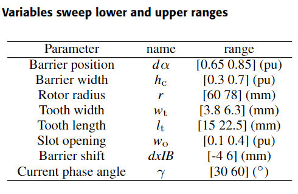

# Galileo Ferraris Contest

Comparing data-driven methodologies for the  multi-physics simulation of traction electrical machines

- <a href="https://github.com/cadema-PoliTO/GalFer_contest/blob/main/Presentations/01_motivation.pdf" target="_blank">Motivation
- <a href="https://github.com/cadema-PoliTO/GalFer_contest/blob/main/Presentations/02_contest.pdf" target="_blank">Contest
- <a href="https://github.com/cadema-PoliTO/GalFer_contest/blob/main/Presentations/03_organization.pdf" target="_blank">Organization
- <a href="https://github.com/cadema-PoliTO/GalFer_contest/blob/main/Presentations/04_rules.pdf" target="_blank">Rules
- <a href="https://github.com/cadema-PoliTO/GalFer_contest/blob/main/Presentations/05_dataset.pdf" target="_blank">Dataset
- <a href="https://github.com/cadema-PoliTO/GalFer_contest/blob/main/Presentations/Advisory_Board.pdf" target="_blank">Advisory Board

Who was <a href="https://github.com/cadema-PoliTO/GalFer_contest/blob/main/Presentations/GalFer_Comic.pdf" target="_blank">Galileo Ferraris

## 2024/10/30 - Deadline for GalFer contest enrolment postponed to 2024/11/15

## List of participants (updated 2024/11/19)

- Altair E-Motor Team, Altair Engineering France, Grenoble, France
- Brainwave Bulided, Shenzhen MSU-BIT University, Shenzhen, China
- CAD Lab Team, University of Pavia, Pavia, Italy
- CREATORs, TU Darmstad - TU Graz - Siemens AG, Darmstad, Germany
- DK-TIC, DAIKIN Industry, Osaka, Japan
- EATUB, TU Berlin, Berlin, Germany
- ECAD, Dongguk University, Soonchunhyuang University and Hanyang University, Seoul, Republic of Korea
- ELECTA, KU Leuven/Energyville, Leuven, Belgium
- Electric System Design Lab, Hosei University, Tokyo, Japan
- e-Machine Learners, University of Wisconsin-Madison, Madison, United States of America
- GTR, University of Lille, Lille, France
- GTB-ULille, University of Lille, Lille, France
- i3@EPFL, Sonceboz SA, Lausanne, Switzerland
- IEML, Amirkabir University of Technology, Tehran, Iran
- Kangaroos, University of Technology Sydney, Sydney, Australia
- LASEteam, The University of British Columbia, Vancouver, Canada
- Machinery warriors, Rajiv Gandhi University of Knowledge Technology, Nuzvid, India
- ManTriS, Politecnico di Torino, Torino, Italy
- McGill MagNets, McGill University, Montreal, Canada
- MELSUR, Mitsubishi Electric Corporation, Hyogo, Japan
- MLotors, Indian Institute of Technology Bhubaneswar, Jatni, India
- MotorAI, Ritsumeikan University, Shiga, Japan
- Motorplus, Motorplus, Teheran, Iran
- Nature-Inspired Computational Intelligence Lab, Brock University, St Catharines, Canada 
- SHIME-PARFAIT, Aoyama Gakuin University, Kyoto, Japan
- The overfitters, Virtual Vehicle Research GmbH, Graz, Austria
- Torque Titans, CG Power and Industrial Solutions Limited, Bhopal, India

### 2024/10/17 - First release of the dataset for Motor "A"

- the dataset containing input and output data on Motor "A" configuration (details in file "04_Rules.pdf" on main page) has been made available to the teams enrolled in the contest;

- the dataset contains 4096 records obtained sampling an 8-dimensional space of degrees of freedom (input) and computing 7 objectives (output);

	

- the design objectives are: torque $$(T)$$, torque ripple $$(TR)$$, copper mass $$(M_\mathrm{Cu})$$, magnet mass $$(M_\mathrm{mag})$$, power factor $$(cos(\varphi))$$, Von Mises equivalent stress $$(VM)$$, and maximum temperature on the winding $$(Temp)$$

- results are computed applying the workflow described in file "02_contest.pdf";

- sampling is performed using a Sobol procedure covering the whole hypercube of inputs;

- all 4096 results are reported in datasets, even if some of them should be ruled out due to "unphysical" motor conditions. Advised filtering values are $$VM\leq455 \mathrm{MPa}$$ , $$Temp\leq180 \mathrm{C}$$. If these values are used, a number of 2765 feasible configurations should be obtained;

- in order to produce graphs with a similar setup, it is advised that all the objectives have to be minimised. As maximum torque and power factor are requested, this implies that the minimum of -Torque and $$-(cos(\varphi))$$ are sought;

- four different Pareto optimal subproblems are defined:
    - $$2D_1 \rightarrow$$ $$O_1=-T$$, $$O_2=TR$$
    - $$2D_2 \rightarrow$$ $$O_1=-T$$, $$O_2=VM$$
    - $$2D_3 \rightarrow$$ $$O_1=-T$$, $$O_2=Temp$$
    - $$3D_1 \rightarrow$$ $$O_1=-T$$, $$O_2=VM$$, $$O_3=Temp$$

# Operative Rules for GalFer's Contest

## Structure of the Contest

The contest aims to compare the accuracy and efficiency of data-driven procedures when applied to a dataset regarding electric motors for traction. The Contest has the following rules.

### What contest will provide

1. datasets on electrical machines will be made available on the **GitHub** website **only to the research teams that will join the Contest**;  
2. datasets are *open* according to Apache License 2.0;  
3. details about the technical contest (kind of motor, target performance, design variable space, etc.) are provided in the slides available on this GitHub website;  
4. two complete *training* datasets, produced according to the workflow described in <a href="https://github.com/cadema-PoliTO/GalFer_contest/blob/main/Presentations/02_contest.pdf" target="_blank">Contest</a> and referring to two kinds of motor, will be shared using **.csv** files containing, in each row, the variables defining motor configuration and motor performance. The number of configurations in each public dataset will be  **4096**; the third dataset, referring to a *hidden* motor, will be provided in a limited size of **256** configurations;

### What research groups will provide

1. research groups that intend to join the Contest will send a *letter of intent* (template and deadline provided in the following);  
2. research groups will provide procedures either in **Matlab** or in **Python** source code and a document, in the form of slides, explaining their procedures;  
3. research groups taking part in the Contest will have to *train* their procedures on the two public datasets and *test* them on the third dataset;
4. organizers will re-run the procedures to assess results and computational effort for the training and evaluation phase;  
5. the focus of the Contest will be on the *multi-criteria* evaluation capabilities of the data-driven procedures, thus the target of the procedures will be the evaluation of the *Pareto Front* in the performance space;  
6. the quality of the results will be judged on the third dataset referring to the *hidden* motor. The *reference Pareto Front (rPF)* will be created by Contest organizers by running a dataset with a large number of configurations;  
7. Results will be evaluated on the basis of the following parameters:  
   1. *accuracy*: distance from the rPF, Generational Distance (GD), Reverse generational distance (RGD), Spacing (S), and Error ratio (ER);  
   2. *efficiency:* number of tunable parameters of the model, computational effort of the training process, and computational effort for the evaluation of Pareto Front.
8. unless previously defined with Contest organizers, the data and procedures provided by participants will be considered as a *public disclosure*.

### Awards

The number of awards and their economic content will be defined as soon as the sponsorship collection is completed.

Any research group can attend the Contest, submit their results, and have them ranked according to the previously defined criteria. However, *awards* with economic rewards will be reserved for *academic teams* formed as defined in the following.

### Timeline

1. the datasets will be available in **September 2024**;  
2. research groups planning to take part in the Contest are invited to submit their intention to join the Contest using the <a href="https://github.com/cadema-PoliTO/GalFer_contest/blob/main/GalFer_letter_of%20_intent.docx">letter of intent</a> following the template provided by mailing it to the address [**galfercontest@gmail.com**](mailto:galfercontest@gmail.com), at last by **November 15th, 2024**;  
3. sharing of the preliminary results from the research teams and first informal evaluation, by **January 15th, 2025**;
4. publication of the *partial* dataset on the third machine by **January 31st, 2025;**  
5. final results and procedures must be submitted by the research teams by **April 15th, 2025**;  
6. award ceremony will be held in a dedicated *free* workshop during the COMPUMAG 2025 Conference in Naples, **June 22-26, 2025**.

